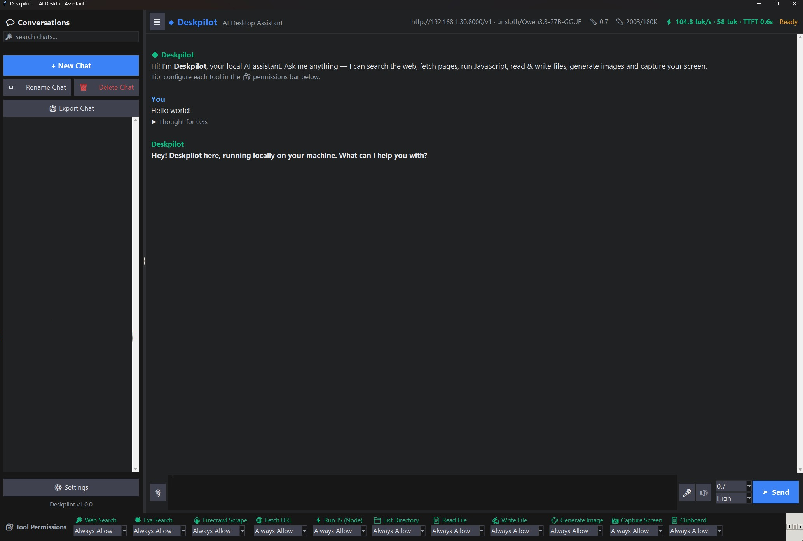
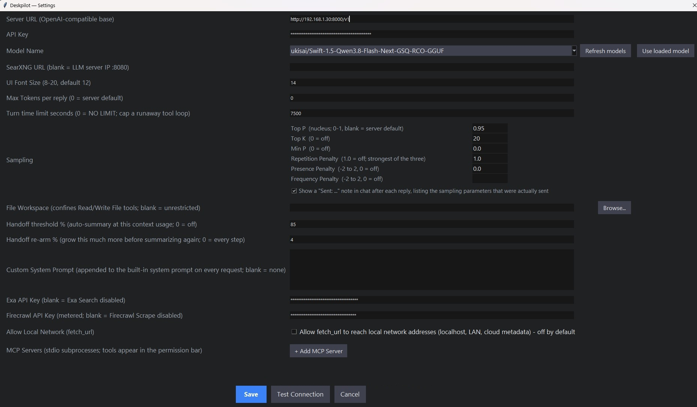

# Deskpilot

Deskpilot is a standalone, AI desktop assistant built with Python and Tkinter. Designed for power users, it acts as a fully agentic copilot on your local machine.

It integrates seamlessly with any OpenAI-compatible server (LM Studio, Ollama, vLLM, Unsloth Studio/Desktop, or the official OpenAI API) and features an extensive suite of built-in tools, **full Model Context Protocol (MCP) extensibility**, and robust security guardrails.

## ✨ Key Features

* **Universal LLM Support:** Plug into any local open-source model or cloud API via the standard OpenAI protocol.
* **Model Context Protocol (MCP):** Connect external MCP servers (via `stdio`) to dynamically give your AI new capabilities. Deskpilot handles the JSON-RPC translation, seamlessly mapping external tools into standard OpenAI function calls.
* **Agentic Tool Suite:** Out-of-the-box, the AI can search the web, fetch pages, write/read local files, run JavaScript via Node, generate images, and capture your screen.
* **Dark Mode UI:** A dark interface featuring asynchronous Markdown streaming, fenced code blocks with 📋 Copy buttons, collapsible reasoning/tool accordions, and a custom Windows dark title bar.
* **Local Voice & Audio:** Continuous microphone dictation (powered by local `faster-whisper`) and local Text-to-Speech (powered by `kokoro-onnx`).
* **Context Handoff:** Automatic chat summarization and session rollover when the context window reaches a user-defined threshold.
* **Advanced Workspace Management:** Drag-and-drop sidebar thread reordering, live search filtering, and Markdown chat exports.

## 🛡️ Architecture & Security First

Deskpilot is built to run unattended AI agents safely on your hardware. It implements several robust security and performance patterns:

* **Thread-Safe Tkinter UI:** All network operations and tool executions run in background daemon threads. State mutations are marshalled back to the main GUI thread via a strict message-passing queue.
* **SSRF & DNS-Rebinding Protection:** The `fetch_url` tool explicitly resolves and drops connections to loopback (`127.0.0.1`), LAN (`RFC1918`), and cloud-metadata addresses. *(Can be bypassed for local development via the "Allow Local Network" setting).*
* **Strict File Sandboxing:** The `read_local_file` and `write_local_file` tools are hard-blocked from touching core Windows/Linux system directories, and can be further confined to a specific "File Workspace" folder in Settings.
* **Default-Deny MCP Integration:** Because MCP servers execute arbitrary local processes, dynamically discovered tools automatically populate in the UI permissions bar and default to "Ask Permission" before execution.
* **Transient Stream Retries:** Automatically recovers from temporary dropped connections (e.g., LM Studio restarts or Wi-Fi blips) without leaving corrupted array states or double-printing UI elements.
* **Connection Pooling:** Open sockets are cached across turns, dropping the TLS/TCP handshake latency for fast tool chaining.

*See Linux and Windows install files for setup instructions.*

---