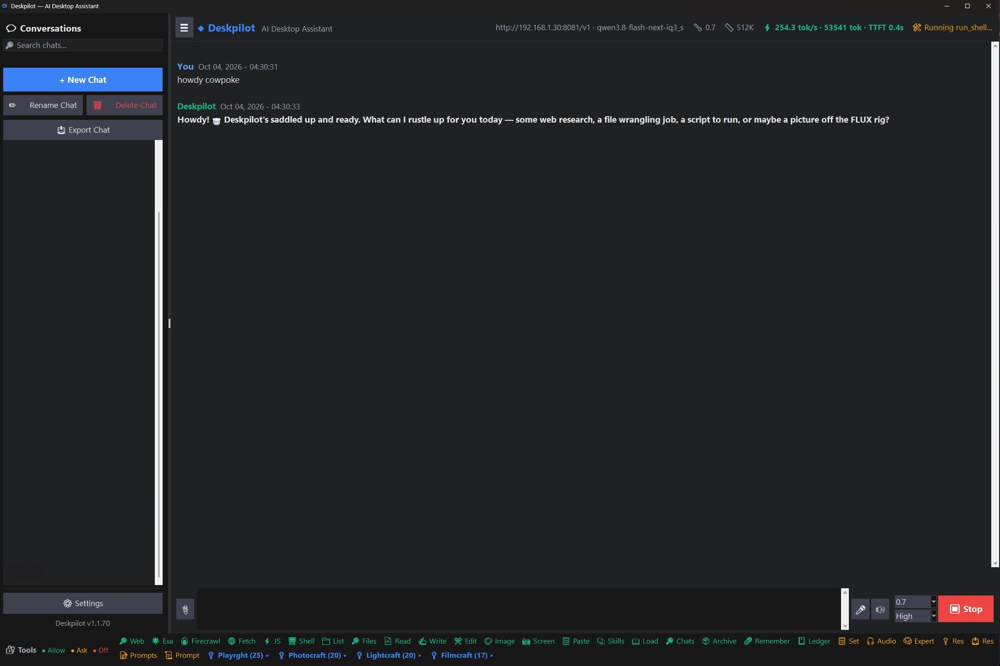
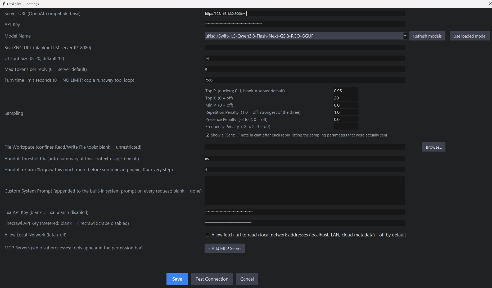

# Deskpilot





Deskpilot is a standalone, AI desktop assistant built with Python and Tkinter. Designed for power users, it acts as a fully agentic copilot on your local machine.

It integrates seamlessly with any OpenAI-compatible server (LM Studio, Ollama, vLLM, llama.cpp, Unsloth Studio/Desktop, or the official OpenAI API) and features an extensive suite of **27 built-in tools**, **full Model Context Protocol (MCP) extensibility**, durable agent memory, and robust security guardrails. Everything runs on your machine — the UI, the tools, the speech models. Only the chat itself leaves for your LLM server. Current release: **v1.1.70**.

## ✨ Key Features

* **Universal LLM Support:** Plug into any local open-source model or cloud API via the standard OpenAI protocol. Model dropdown with history, per-chat **Temperature** and **Thinking** controls, and a global **Sampling** panel (top_p, top_k, min_p, repetition / presence / frequency penalties) with a "what was actually sent" probe so you can verify what your server honours.
* **Agentic Tool Suite (27 tools):** Web search (SearXNG, Exa, Firecrawl), page fetching, shell and JavaScript execution via Node, local file read/write/**transactional edit**, directory listing, bounded grep, clipboard read **and** write, desktop screenshots auto-attached for vision analysis, local FLUX/SDXL image generation, and audio-file transcription. Every tool has its own permission chip — **green = Always Allow, amber = Ask Permission, red = Off** — click to cycle; "Off" removes the tool from the request entirely.
* **Model Context Protocol (MCP):** Connect external MCP servers (via `stdio`) to dynamically give your AI new capabilities. Deskpilot handles the JSON-RPC translation, seamlessly mapping external tools into standard OpenAI function calls (`mcp_<server>_<tool>`), and also exposes each server's **resources** and **prompt templates** through four dedicated tools. A bundled Node.js runtime means `npx`-launched servers work out of the box.
* **Durable Memory:** Three layers, all local. A **SQLite FTS5 full-text index** over every message of every chat (`search_chats`, including archived turns); an **append-only ledger** per chat plus a shared global one (`remember` / `read_ledger`) that survives compaction, handoff and even chat deletion; and a **project memory index** — the workspace's `MEMORY.md` plus each project's own `MEMORY.md`, injected bounded into every system prompt.
* **Context Handoff & Compaction:** Automatic chat summarization and session rollover when the context window reaches a user-defined threshold, plus in-place **context compaction** that folds old turns into expandable drawers while keeping the originals searchable. A live **📏 context-usage gauge** and **⚡ tokens/sec + TTFT** readout sit in the top bar.
* **Reversible File Edits:** Each turn snapshots the original bytes of every file it touches (`write_local_file` / `edit_local_file`), so **↺ Revert turn** undoes the whole turn at once — no more one-`.bak`-deep roulette when the agent edits real code.
* **Agent Skills:** Reusable procedures in the open [Agent Skills](https://agentskills.io) format — a folder with a `SKILL.md`. Only each skill's name and description cost context; the instructions load on demand via `load_skill`. Point Settings at an existing skill collection to use it as-is.
* **Second-Opinion Expert:** `ask_expert` consults a *separate* OpenAI-compatible model (its own URL, key and model in Settings) for a narrow review, debug or design opinion. The local model stays primary and in charge; the permission modal always shows the exact payload before it leaves the machine.
* **Local Voice & Audio:** Continuous microphone dictation (powered by local `faster-whisper`, on the **GPU** with `large-v3-turbo` when cuBLAS is available, CPU `base.en` otherwise) and local Text-to-Speech (powered by `kokoro-onnx`) — no cloud round-trips.
* **Dark Mode UI:** A dark interface featuring asynchronous Markdown streaming, fenced code blocks with 📋 Copy buttons, collapsible ▶/▼ accordions for **Tool Calls**, **Model Reasoning** and **Tool Output**, resizable split-pane layout, collapsible sidebar (☰), adjustable UI font size, and a custom Windows dark title bar.
* **Advanced Workspace Management:** Drag-and-drop sidebar thread reordering, live title filtering plus deferred full-text body search with click-to-jump highlighting, Markdown chat export, per-chat rename/delete, and a per-prompt turn time limit.

## 🛡️ Architecture & Security First

Deskpilot is built to run unattended AI agents safely on your hardware. It implements several robust security and performance patterns:

* **Thread-Safe Tkinter UI:** All network operations and tool executions run in background daemon threads. State mutations are marshalled back to the main GUI thread via a strict message-passing queue — the interface never freezes, and **⏹ Stop** unwinds long streams and tool calls cleanly.
* **SSRF & DNS-Rebinding Protection:** The `fetch_url` tool explicitly resolves and drops connections to loopback (`127.0.0.1`), LAN (`RFC1918`), link-local and cloud-metadata addresses, and re-validates every redirect hop. *(Can be bypassed for local development via the "Allow Local Network" setting.)* Responses that are really an anti-bot / JavaScript challenge wall are detected and reported instead of being passed off as content.
* **Strict File Sandboxing:** The local file tools are hard-blocked from core Windows/Linux system directories — derived from the actual system drive and every fixed/removable drive, not a hardcoded `C:\` — and can be confined to a specific "File Workspace" folder in Settings. Path traversal is rejected component-by-component, and every edit is shown as a unified diff before it is applied.
* **Default-Deny MCP Integration:** Because MCP servers execute arbitrary local processes, dynamically discovered tools automatically populate in the UI permissions bar and default to "Ask Permission" before execution. Servers with many tools collapse to a single header so the bar cannot be flooded.
* **Graceful Degradation:** Transient stream drops (LM Studio restarts, Wi-Fi blips) are retried automatically without leaving corrupted array states or double-printing UI elements; unsupported request options (e.g. `stream_options`) are dropped and the request retried; a server that ignores a sampler is reported rather than silently assumed.
* **Connection Pooling:** Open sockets are cached across turns, dropping the TLS/TCP handshake latency for fast tool chaining — while diagnostic probes use their own short-lived client so they can never perturb a live turn.

---

## 📦 Install

**Windows — easiest, one file.** Download the installer and double-click it. It bundles Python, all dependencies and Node.js, needs no admin rights, and leaves your settings and chat history untouched when uninstalled:

* ⬇️ **[DeskPilot-Setup-1.1.70.exe](https://github.com/shuhdonk/DeskPilot/raw/main/installer/DeskPilot-Setup-1.1.70.exe)** — 128 MB

> **If your browser shows the file page instead of saving it:** GitHub cannot *preview* a binary this large, so the [`blob/…` page](https://github.com/shuhdonk/DeskPilot/blob/main/installer/DeskPilot-Setup-1.1.70.exe) prints "we can't show files that are this big right now" — that is only the viewer. The file itself is there: use the **raw** link above, or press **Download raw file** (the ⬇ icon) on that page. Alternatively, `git clone` fetches it automatically — it is stored with Git LFS.

**Windows / Linux from source:** follow [INSTALL_WINDOWS.md](INSTALL_WINDOWS.md) or [INSTALL_LINUX.md](INSTALL_LINUX.md) — step-by-step, copy-paste ready.

```bash
pip install -r requirements.txt   # openai is required; the rest are optional extras
python deskpilot.py
```
